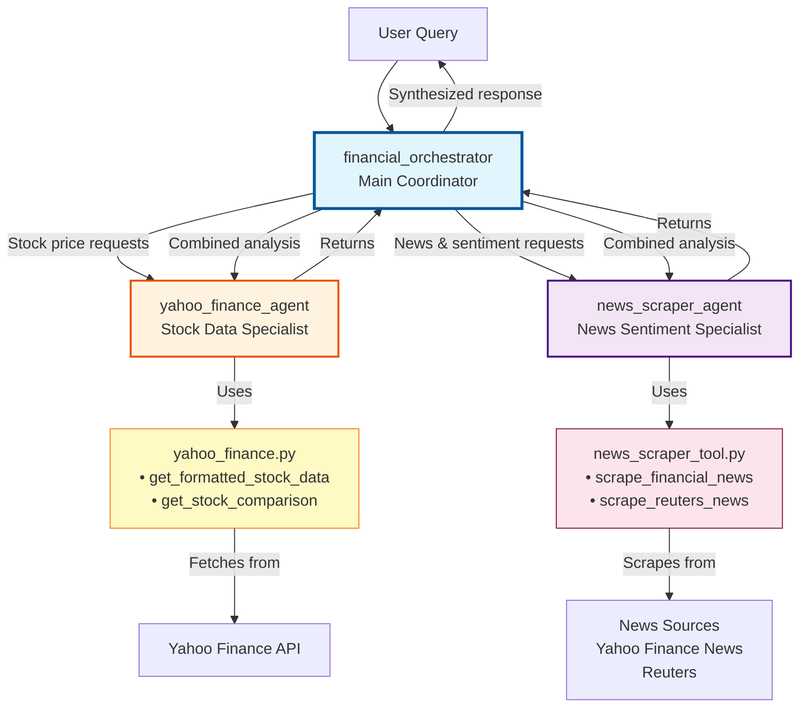

# watsonx.Orchestrate Financial Intelligence Agent System

A multi-agent system for financial analysis built with IBM watsonx Orchestrate. Provides real-time stock market data and financial news sentiment analysis through specialized AI agents.

## Overview

This system demonstrates how to build and deploy AI agents using watsonx Orchestrate ADK. It consists of three specialized agents working together to provide comprehensive financial intelligence.

## Project Structure

```
Lab 2 - Materials/
├── wxo-financial-agent/
│   ├── agents/
│   │   ├── yahoo-finance-agent.yaml      # Stock data agent (provided)
│   │   ├── news-scraper-agent.yaml       # News sentiment agent (to build)
│   │   └── main-orchestrator.yaml        # Main coordinator (to build)
│   └── tools/
│       ├── yahoo_finance.py              # Stock data tools (provided)
│       └── news_scraper_tool.py          # News scraping tools (to build)
├── requirements.txt                       # Python dependencies
├── BOB_INSTRUCTIONS.md                    # Detailed technical guide
└── readme.md                             # This file
```

## Agent Architecture



### Agents

1. **financial_orchestrator** - Main coordinator that intelligently routes requests to specialized agents
2. **yahoo_finance_agent** - Retrieves real-time stock prices, historical trends, and market metrics
3. **news_scraper_agent** - Scrapes financial news and performs sentiment analysis

### Capabilities

- Real-time stock prices and market data
- Historical trends and performance analysis
- Multi-stock comparisons
- Financial news aggregation from multiple sources
- VADER sentiment analysis with confidence scores
- Intelligent query routing and response synthesis

## Prerequisites

- Python 3.11+
- watsonx Orchestrate account (trial or subscription)
- Internet access for API calls

## Usage Examples

### Stock Price Query
```
"What's the current price of Apple stock?"
```

### News Sentiment
```
"What's the market sentiment for tech stocks today?"
```

### Combined Analysis
```
"Analyze Tesla: show me the stock price and recent news sentiment"
```

### Multi-Stock Comparison
```
"Compare AAPL, GOOGL, and MSFT performance"
```

## Testing

Test agents in the watsonx Orchestrate UI:
1. Log in to watsonx Orchestrate
2. Navigate to Agent Builder
3. Select `financial_orchestrator`
4. Use the test chat interface

## Documentation

- **BOB_INSTRUCTIONS.md** - Detailed technical implementation guide
- **env.example** - Environment configuration template

For detailed technical instructions, troubleshooting, and best practices, refer to `BOB_INSTRUCTIONS.md`.
