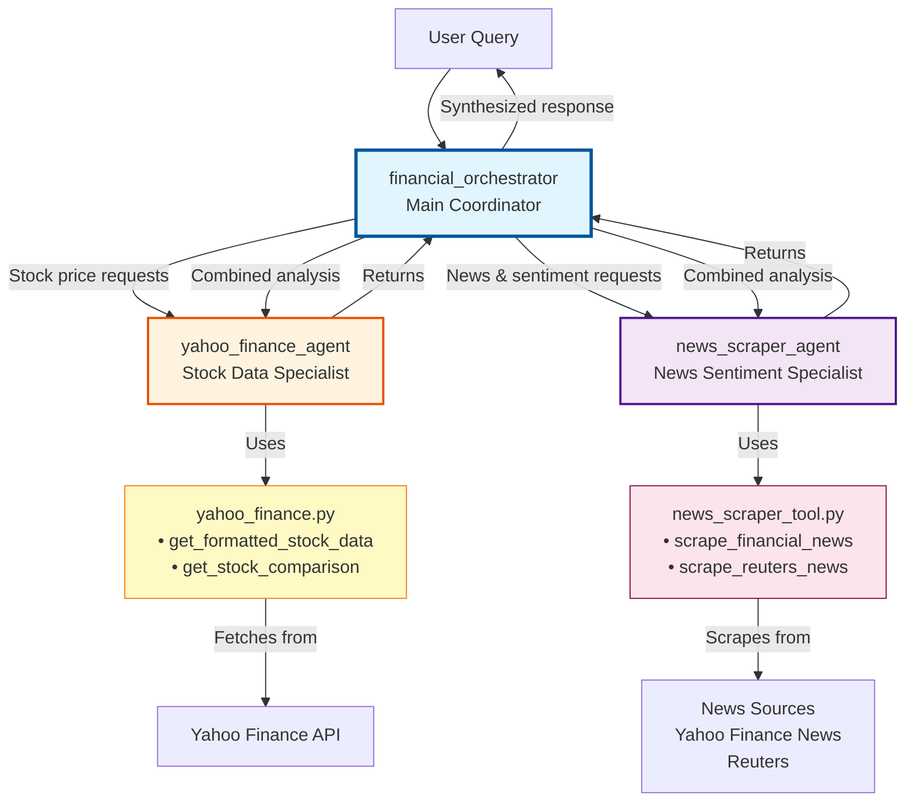

# Lab 2: watsonx.Orchestrate Financial Intelligence Agent System

A multi-agent system for financial analysis built with IBM watsonx Orchestrate. Provides real-time stock market data and financial news sentiment analysis through specialized AI agents.

## Overview

This system demonstrates how to build and deploy AI agents using watsonx Orchestrate ADK. It consists of three specialized agents working together to provide comprehensive financial intelligence.

## Project Structure

```
Lab 2 - Materials/
├── agents/
│   ├── yahoo-finance-agent.yaml          # Stock data agent (provided)
│   └── news-scraper-agent.yaml           # News sentiment agent (to build)
├── tools/
│   ├── yahoo_finance.py                  # Stock data tools (provided)
│   └── news_scraper_tool.py              # News scraping tools (to build)
├── requirements.txt                      # Python dependencies
├── env.example                           # Environment configuration template
├── BOB_INSTRUCTIONS.md                   # Detailed technical guide
└── readme.md                             # This file
```

## Agent Architecture



### Agents

1. **financial_orchestrator** - Main coordinator that intelligently routes requests to specialized agents
2. **yahoo_finance_agent** - Retrieves real-time stock prices, historical trends, and market metrics
3. **news_scraper_agent** - Scrapes financial news and performs sentiment analysis

### Capabilities

- Real-time stock prices and market data
- Historical trends and performance analysis
- Multi-stock comparisons
- Financial news aggregation from multiple sources
- VADER sentiment analysis with confidence scores
- Intelligent query routing and response synthesis

## Prerequisites

- Python 3.11+
- watsonx Orchestrate account (trial or subscription)
- watsonx Orchestrate CLI installed
- Internet access for API calls

### Verify Prerequisites

Before starting, verify your environment:

```bash
# Check Python version (should be 3.11+)
python --version

# Check if orchestrate CLI is installed
orchestrate --version

# If orchestrate CLI is not installed, install it:
pip install ibm-watsonx-orchestrate-cli
```

## Setup

### Step 1: Configure Credentials

Before starting the lab, you need to set up your watsonx Orchestrate credentials:

1. **Copy the environment template:**
   ```bash
   cd "Lab 2 - Materials"
   cp env.example .env
   ```

2. **Edit `.env` file and add your credentials:**
   ```bash
   WXO_API_KEY=your_actual_api_key_here
   WXO_INSTANCE_URL=https://api.us-south.watson-orchestrate.cloud.ibm.com/instances/your_actual_instance_id
   ```

3. **Where to get your credentials:**
   - **API Key**: Log in to watsonx Orchestrate → Settings → API Keys → Create new key
   - **Instance URL**: watsonx Orchestrate → Settings → Instance Details → Copy instance URL

### Step 2: Install Dependencies

```bash
# Install Python dependencies
pip install -r requirements.txt
```

### Step 3: Configure watsonx Orchestrate CLI

```bash
# Add your environment (use your actual instance URL)
orchestrate env add -n production \
  -u https://api.us-south.watson-orchestrate.cloud.ibm.com/instances/YOUR_INSTANCE_ID \
  -a

# Activate the environment
orchestrate env activate production

# Verify environment is active
orchestrate env list
```

**Note:** The `.env` file approach ensures your credentials are ready for all deployment commands and prevents authentication errors during implementation.

## Usage Examples

### Stock Price Query
```
"What's the current price of Apple stock?"
```

### News Sentiment
```
"What's the market sentiment for tech stocks today?"
```

### Combined Analysis
```
"Analyze Tesla: show me the stock price and recent news sentiment"
```

### Multi-Stock Comparison
```
"Compare AAPL, GOOGL, and MSFT performance"
```

## Testing

Test agents in the watsonx Orchestrate UI:
1. Log in to watsonx Orchestrate
2. Navigate to Agent Builder
3. Select `financial_orchestrator`
4. Use the test chat interface

## Documentation

- **BOB_INSTRUCTIONS.md** - Detailed technical implementation guide
- **env.example** - Environment configuration template

For detailed technical instructions, troubleshooting, and best practices, refer to `BOB_INSTRUCTIONS.md`.
